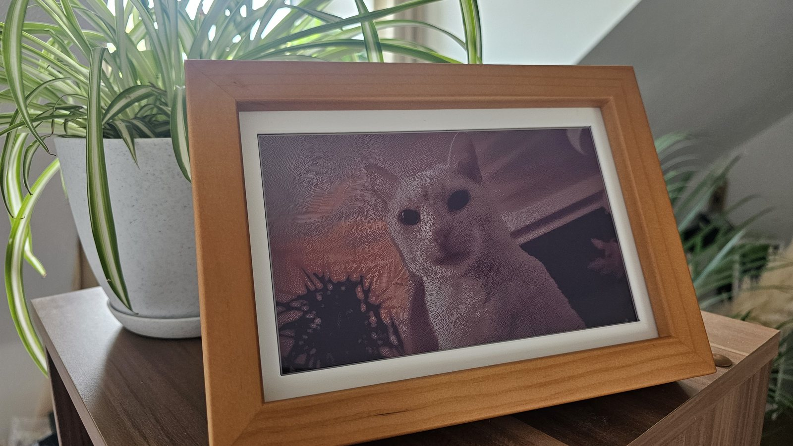
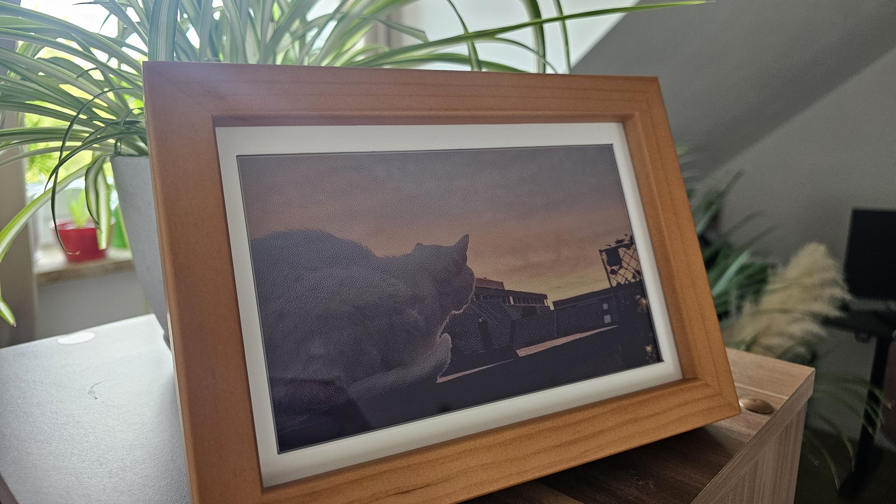

# photopainter-jpg

Firmware for the Waveshare PhotoPainter that reads JPEGs straight off the SD card.

The stock firmware only shows 24-bit BMPs in the exact panel palette, so every photo **has to go**
through Waveshare's converter tool first. For me it was not handy at all, so I've decided to get rid of the converter tool & enable support for JPG natively.

So now you have to: put `.jpg` files in `pic/`, done. 
No WiFi, no app, no cloud.



## Flash it

1. Grab `photopainter-jpg.uf2` from [Releases](../../releases).
2. Hold **BOOT**, plug in USB, release. A drive called `RPI-RP2` shows up.
3. Copy the `.uf2` onto it. The frame reboots on its own. Done.

## Use it

Put your photos in a folder called `pic` on the SD card:

```
pic/
  IMG_0234.jpg
  mum.jpg
  cat.bmp
```

Any size, any aspect ratio, straight from a phone. 
The frame picks the next one every 24 hours, sorted by filename. BMPs still work like before.
You can manually enforce a change by clicking the "NEXT" button on your photopainter.

## What it does to your photos

- Scales down & center-crops to 800×480, so the picture fills the panel
- Portrait photos get turned 90°, so they **fill** the panel too, you can turn the frame on its side.
  *If they end up rotated the wrong way for you, flip `PORTRAIT_CW` in `lib/GUI/GUI_JPGfile.c`.*
- Reads EXIF orientation, so phone pictures aren't sideways
- Floyd-Steinberg dithering against the colours the panel actually produces, not the ideal RGB
  values. Skin tones & skies come out noticeably better than with a naive palette match.

A 12 MP photo takes about 15 seconds to decode, plus the ~33 seconds the panel needs to refresh.
The RP2040 runs at 250 MHz for this.



Seven colours & a dusk sky is about the hardest thing you can ask of this panel but it holds up!

## Change the interval

In `main.c`:

```c
alarmTime.hours += 24;      // every 24 hours
// alarmTime.minutes += 30; // every 30 minutes
```

Then rebuild.

## Build it yourself

You need the [Raspberry Pi Pico extension](https://marketplace.visualstudio.com/items?itemName=raspberry-pi.raspberry-pi-pico)
for VS Code — it installs the SDK & the ARM toolchain for you. Open the folder, run
**Raspberry Pi Pico: Import Project**, then **Compile**. The `.uf2` lands in `build/`.

From a terminal it's the usual:

```sh
cmake -S . -B build -G Ninja
ninja -C build
```

## Which hardware

Waveshare sells several frames called PhotoPainter. This one is for the original
[PhotoPainter](https://www.waveshare.com/photopainter.htm): RP2040, 7.3" 7-colour ACeP panel.

| Model | |
|---|---|
| PhotoPainter (RP2040) | this one |
| PhotoPainter (B) — Pico 2, Spectra 6 | small port, see below |
| ESP32-S3-PhotoPainter | no & it doesn't need one — that firmware already decodes JPEG |
| RPi Zero PhotoPainter | no, that one runs Linux, where Pillow does the job in ten lines |

Porting to the (B) is not much work: the pinout is the same, so it comes down to swapping
`lib/e-Paper` for its `EPD_7in3e` driver, setting `PICO_BOARD pico2` & rewriting `PAL[]` in
`lib/GUI/GUI_JPGfile.c` for the six Spectra colours -> no orange & the indices are different.
Open an issue if you have one & want to try it, I don't have the hardware here.

## Limits

- Baseline JPEG only. Progressive JPEGs get a message on the panel instead of garbage. Phone and
  camera photos are baseline; *some web downloads aren't*.
- No HEIC. Export as JPEG.
- 8.3 filenames are safest. Long names work but FatFs is picky about some characters.

## Credits

Built on Waveshare's [PhotoPainter firmware](https://github.com/waveshareteam/PhotoPainter) and
ChaN's [TJpgDec](http://elm-chan.org/fsw/tjpgd/). Panel colour values borrowed from Pimoroni's Inky
library, which has clearly spent more time staring at these things than I have.

---

Built by [Alexander West](https://thewest.cc/?utm_source=github&utm_medium=readme&utm_campaign=photopainter-jpg).
